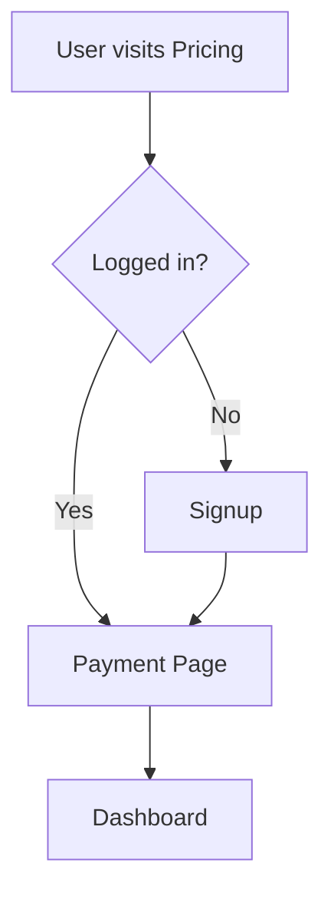

# 🎯 GolfGive — Subscription-Based Charity Gaming Platform

> A modern full-stack SaaS platform where users play, track scores, and contribute to charities through a subscription model.

---

## 🚀 Live Concept

GolfGive combines **gaming + subscriptions + charity impact** into one seamless platform.

Users can:
- Track performance 📊
- Participate in draws 🎟️
- Support charities ❤️
- Win rewards 💰

---
## 🌐 Live Demo

Experience the platform live:

🔗 **Frontend:** [https://golfgive.netlify.app/]
🔗 **Backend API:** [https://golfgive-tpox.onrender.com]

> ⚡ Note: Use demo credentials or sign up to explore full features.

---

## 🧠 Key Features

### 🔐 Authentication System
- Secure signup & login using Supabase
- Token-based authentication
- Protected routes (user/admin)

---

### 💳 Subscription Flow (Stripe Ready)
- Monthly & Yearly plans
- Checkout session integration
- Smart frontend flow (login → payment → dashboard)

---

### 📊 Dashboard System
- User dashboard with:
  - Scores tracking
  - Winnings overview
  - Charity contribution %
  - Draw participation

- Admin dashboard:
  - User monitoring
  - Draw engine
  - Reports & analytics

---

### ❤️ Charity Integration
- Users select preferred charity
- Adjustable contribution percentage
- Transparent breakdown of funds

---

### 🎯 Draw & Rewards System
- Monthly draw participation
- Tier-based winnings
- Real-time tracking

---

### 🎨 Modern UI/UX
- Built with Tailwind CSS
- Glassmorphism design
- Smooth animations
- SaaS-style dashboard layout

---

## 🛠️ Tech Stack

### Frontend
- React.js (Vite)
- Tailwind CSS
- React Router
- Context API

### Backend
- Node.js + Express
- Supabase (Auth + DB)
- Stripe (Payments)

### Other Tools
- Git & GitHub
- REST APIs
- JWT Authentication

---

## 📂 Project Structure
GolfGive/ <br>
│<br>
├── frontend/<br>
│ ├── src/<br>
│ │ ├── pages/<br>
│ │ ├── components/<br>
│ │ ├── context/<br>
│ │ └── lib/<br>
│<br>
├── backend/<br>
│ ├── controllers/<br>
│ ├── routes/<br>
│ ├── middleware/<br>
│ ├── lib/<br>
│ └── server.js<br>
│<br>
└── README.md<br>

---

## 🔄 User Flow


---

🧪 Run Locally
1️⃣ Clone repo
```
git clone https://github.com/Abhiho11a/GolfGive.git
cd GolfGive
```

2️⃣ Install dependencies
```
cd backend
npm install

cd ../frontend
npm install
```

3️⃣ Start project
```
# backend
npm run dev

# frontend
npm run dev
```

